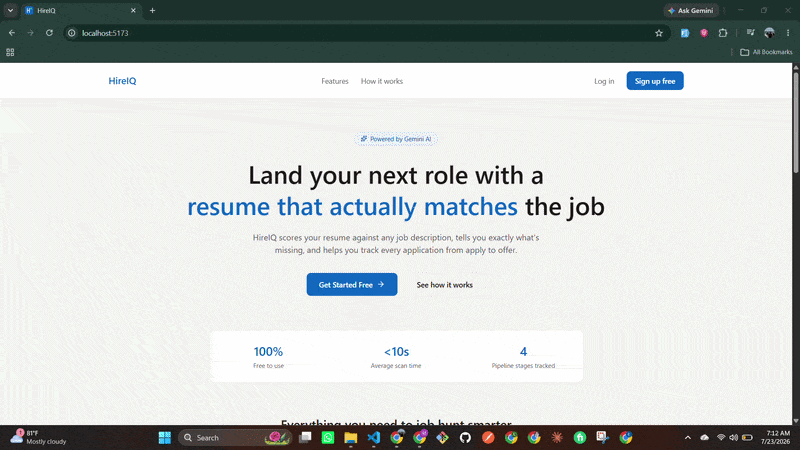
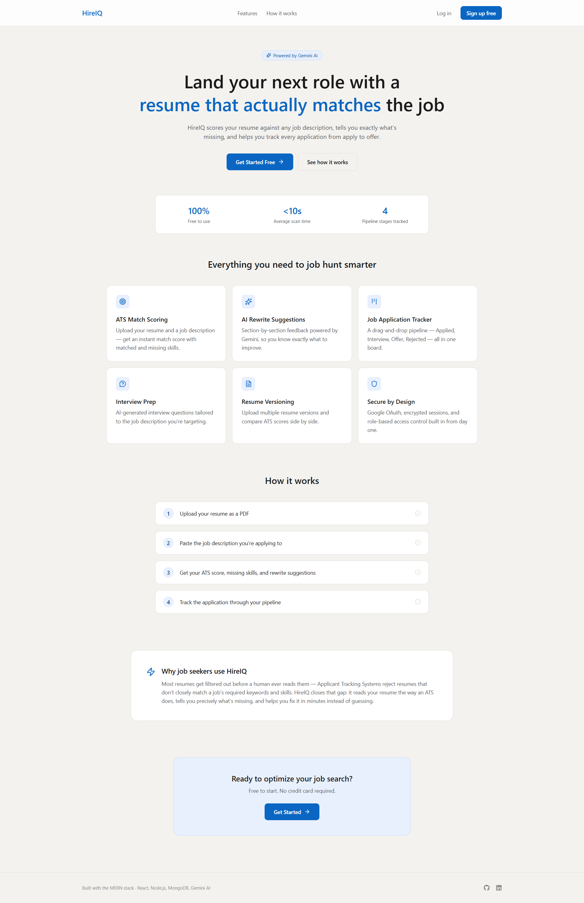
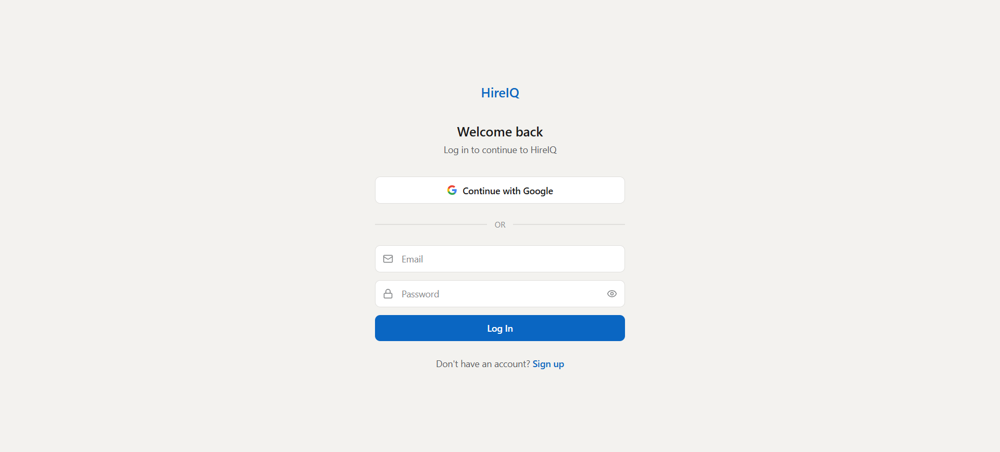
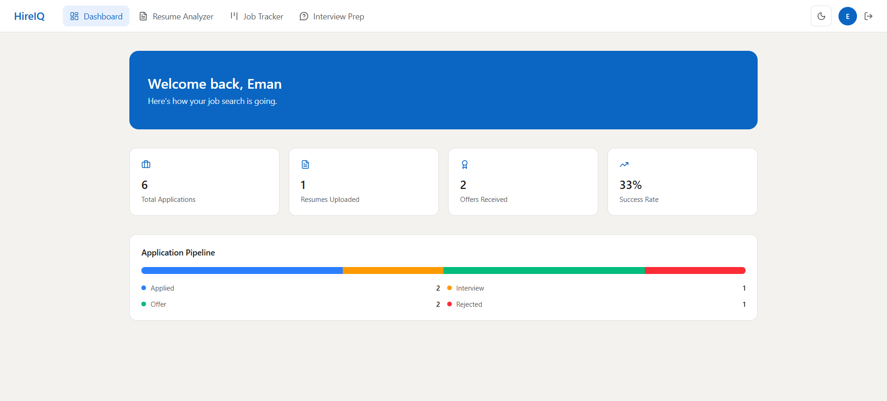
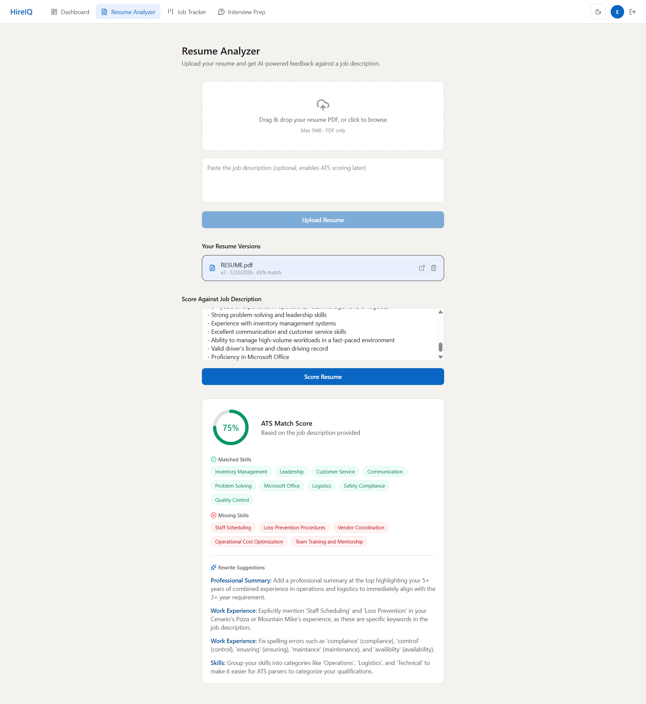
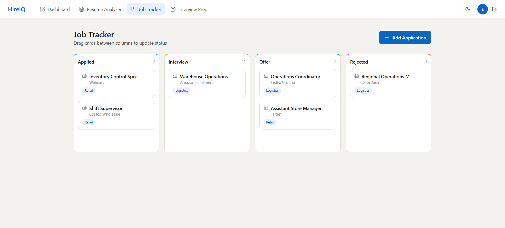
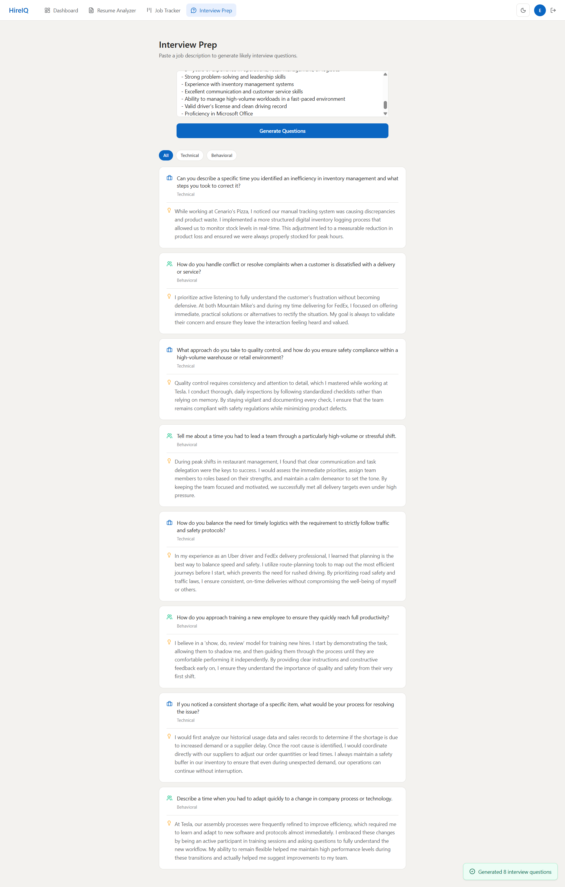
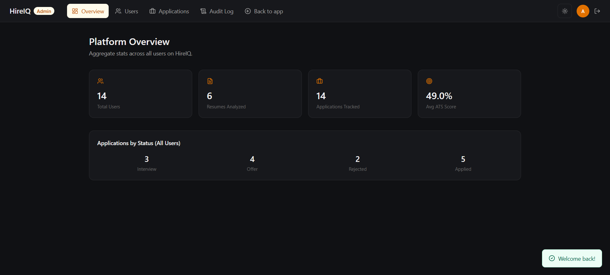
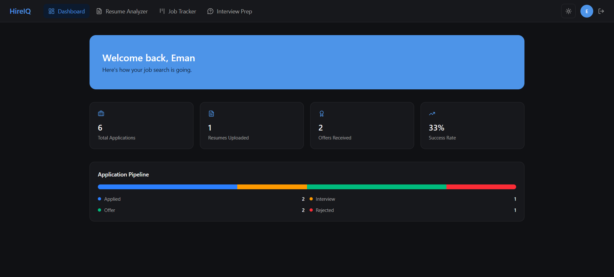
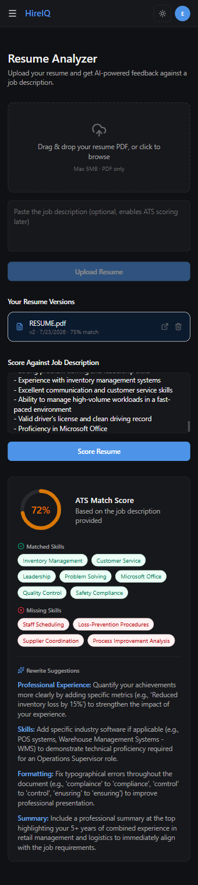

<p align="center">
  
</p>

<h1 align="center">HireIQ</h1>
<p align="center">
  <b>AI-powered resume analyzer & job application tracker</b><br/>
  Score your resume against any job description, get instant feedback, and track every application from apply to offer.
</p>

<p align="center">
  
  
  
  
</p>

<p align="center">
  <a href="#demo">Demo</a> ·
  <a href="#features">Features</a> ·
  <a href="#tech-stack">Tech Stack</a> ·
  <a href="#architecture">Architecture</a> ·
  <a href="#local-setup">Setup</a> ·
  <a href="#api-overview">API</a>
</p>

---

## Demo



**[Live Demo →](#)** *(add your deployed link here)*

---

## Why I Built This

Most resumes get filtered out by Applicant Tracking Systems before a human ever reads them. HireIQ closes that gap — it reads a resume the way an ATS does, tells the candidate exactly what's missing against a specific job description, and helps them track every application through a real pipeline instead of a messy spreadsheet.

It's also a deliberate showcase of production-grade patterns beyond basic CRUD: rotating JWT tokens, role-based access control with audit logging, service-layer AI integration, and full test coverage on the most security-critical code path.

---

## Features

- 🎯 **ATS Match Scoring** — upload a resume PDF, paste a job description, get an instant match score with matched/missing skills
- ✨ **AI Rewrite Suggestions** — section-by-section resume feedback powered by Google Gemini
- 📄 **Resume Versioning** — upload and compare multiple resume versions over time
- 📋 **Job Application Tracker** — drag-and-drop Kanban board (Applied → Interview → Offer → Rejected)
- 💬 **Interview Prep** — AI-generated interview questions with sample answers, tailored to a job description
- 📊 **Dashboard** — pipeline overview, success rate, resume/application stats
- 🛡️ **Role-Based Admin Panel** — platform analytics, user management, and a permanent audit log of every admin action
- 🌓 **Light/Dark Theme** — full app-wide theming with persisted preference
- 📱 **Fully Responsive** — mobile nav, scrollable Kanban and tables on small screens
- 🔐 **Secure Auth** — Google OAuth + email/password, with access/refresh JWT rotation via httpOnly cookies

---

## Screenshots

| Landing | Login | Dashboard |
|---|---|---|
|  |  |  |

| Resume Score | Job Tracker | Interview Prep |
|---|---|---|
|  |  |  |

| Admin Dashboard | Admin Users | Dark Mode |
|---|---|---|
|  |  |  |




---

## Tech Stack

**Frontend:** React · Vite · Tailwind CSS v4 · TanStack Query · Framer Motion · React Router
**Backend:** Node.js · Express · MongoDB · Mongoose
**AI:** Google Gemini API
**Auth:** Passport (Google OAuth20) · JWT (access + refresh rotation)
**Storage:** Cloudinary (resume PDFs)
**Testing:** Jest · Supertest · mongodb-memory-server
**Security:** Helmet · express-rate-limit · express-mongo-sanitize · Zod validation

---

## Architecture


| Layer | Technology | Role |
|---|---|---|
| **Client** | React + Vite | UI, routing, state management |
| **Server** | Express (Node.js) | REST API, business logic |
| **Database** | MongoDB Atlas | Users, resumes, applications, audit logs |
| **AI** | Google Gemini | Resume scoring, interview question generation |
| **File Storage** | Cloudinary | Resume PDF hosting |
| **Auth** | Google OAuth + JWT | Login, session management |

**Flow:** Client → REST API → Server → (MongoDB / Gemini / Cloudinary)

Auth flows through Google OAuth (Passport) → access token (15 min) + refresh token (7 days, hashed, rotated) → stored in httpOnly cookies.


Auth flows through Google OAuth (Passport) → access token (15 min) + refresh token (7 days, hashed, rotated) → stored in httpOnly cookies.

---

## Technical Decisions

- **Access + refresh tokens instead of a single long-lived JWT** — access tokens expire in 15 minutes and are never persisted server-side; refresh tokens are hashed and stored in MongoDB with rotation on every use, so a leaked refresh token has a limited window of usefulness and can be instantly revoked.
- **Audit logging for admin actions** — role changes and user deletions are permanent, high-impact actions. An immutable audit trail (who did what, when) is standard practice for any system with elevated privileges.
- **A protected "bootstrap admin" account** — the first admin is created via a seed script and flagged `isProtected`, preventing accidental lockout if every other admin gets demoted or deleted.
- **Thin controllers, service-layer business logic** — Gemini calls and PDF parsing live in `services/`, not controllers, so the AI provider or parsing library can be swapped without touching route/controller code.
- **Admin has view-only access to user-generated content** — admins can manage user *accounts* (role, existence) but cannot edit or delete a user's personal resumes or applications, following the principle of least privilege used by real platforms (LinkedIn, Slack, GitHub).
- **CSRF** — not implemented as a standalone token system; `sameSite` cookie policy plus strict CORS (`credentials: true`, fixed origin) provides equivalent protection for this architecture.

---

## API Overview

| Method | Endpoint | Description | Auth |
|---|---|---|---|
| POST | `/api/auth/register` | Register with email/password | Public |
| POST | `/api/auth/login` | Login with email/password | Public |
| GET | `/api/auth/google` | Start Google OAuth flow | Public |
| POST | `/api/auth/refresh` | Rotate access/refresh tokens | Cookie |
| GET | `/api/auth/me` | Get current user | Required |
| PATCH | `/api/auth/profile` | Update profile | Required |
| POST | `/api/resume/upload` | Upload + parse a resume PDF | Required |
| GET | `/api/resume` | List user's resumes | Required |
| DELETE | `/api/resume/:id` | Delete a resume | Required |
| POST | `/api/ai/score/:resumeId` | Score resume against a JD | Required |
| POST | `/api/ai/interview-prep/:resumeId` | Generate interview questions | Required |
| GET/POST/PATCH/DELETE | `/api/application` | Job tracker CRUD | Required |
| GET/PATCH/DELETE | `/api/admin/users` | User management | Admin |
| GET | `/api/admin/stats` | Platform-wide stats | Admin |
| GET | `/api/admin/audit-logs` | Admin action history | Admin |

---

## Local Setup

```bash
# Clone
git clone https://github.com/Eman-Nazir/hireiq.git
cd hireiq

# Backend
cd server
npm install
cp .env.example .env   # fill in your own keys
npm run dev

# Frontend (in a new terminal)
cd client
npm install
cp .env.example .env
npm run dev
```

### Creating the First Admin

Admin accounts are never self-registered. To bootstrap the first admin:

```bash
cd server
# Add SEED_ADMIN_NAME, SEED_ADMIN_EMAIL, SEED_ADMIN_PASSWORD to .env
npm run seed:admin
```

Log in with those credentials — you'll land directly on the admin dashboard. All subsequent admins are promoted through the in-app Admin Panel by an existing admin — never via direct database edits.

### Running Tests

```bash
cd server
npm test
```

8 automated tests cover registration, duplicate-email rejection, weak-password rejection, login success/failure, and protected-route authorization — running against an isolated in-memory MongoDB instance.

---

## Environment Variables

See `server/.env.example` and `client/.env.example` for the full list of required keys (MongoDB, Google OAuth, Gemini, Cloudinary).

---

## Known Limitations

Being upfront about scope, not overclaiming:

- No caching layer (Redis) or background job queue — AI scoring is synchronous, fine at portfolio scale, would need a queue under real concurrent load
- No read replicas / horizontal scaling configured — single MongoDB instance and single server process
- Gemini's free tier has rate limits (~15 req/min) — sufficient for demos, not high-volume production traffic

These are intentionally deferred, not oversights — the architecture is designed so scaling up means *adding* pieces, not restructuring what exists.

---

## Author

**Eman Nazir** — MERN Stack Developer


<a href="https://github.com/Eman-Nazir"></a>
<a href="inkedin.com/in/eman-nazir-231145316/"></a>
